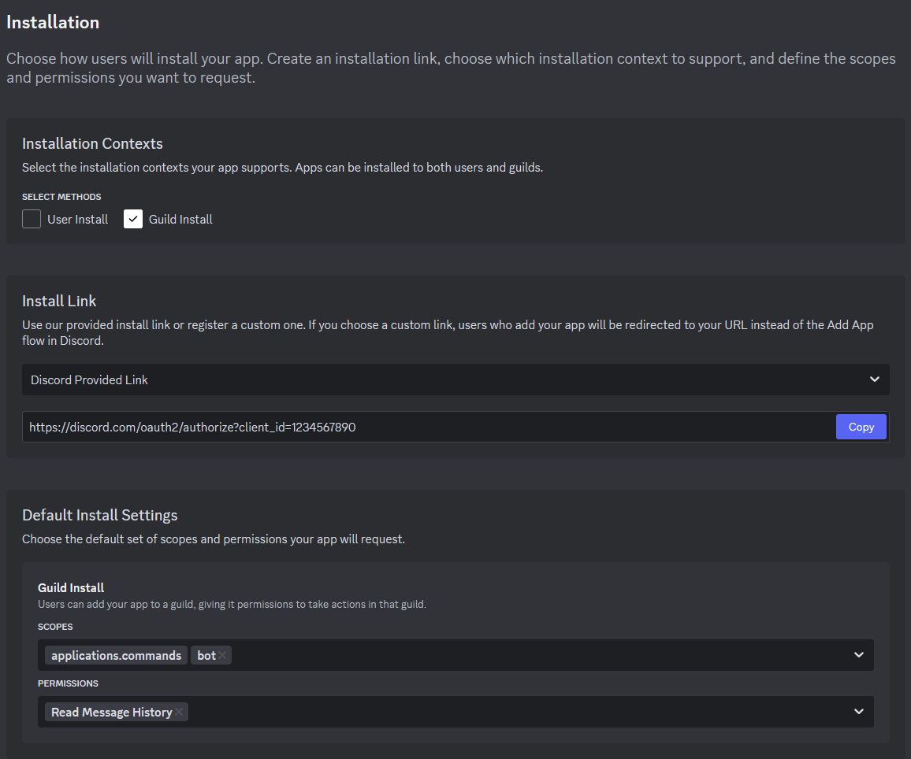

# Discord to FoundryVTT

This FoundryVTT module is designed to push messages from Discord to the game chat log. It runs *only* when the game is
also running, and will not collect or synchronize messages offline.

The module will forward all messages from all channels it has access to. You can assign the bot a role and manage its
permissions through the Discord server interface.

A GM user needs to be logged in for the Discord connection to remain active.

## Module Settings

### Discord Server ID

Enter your Discord server ID, which you can find as described [here](https://support.discord.com/hc/en-us/articles/206346498-Where-can-I-find-my-User-Server-Message-ID#h_01HRSTXPS5FSFA0VWMY2CKGZXA).

### Discord Channel IDs

Enter a list of comma-separated Discord channel IDs, as described [here](https://support.discord.com/hc/en-us/articles/206346498-Where-can-I-find-my-User-Server-Message-ID#h_01HRSTXPS5FMK2A5SMVSX4JW4E).
The bot will only relay messages from these channels.

If this field is blank, the bot will relay messages from all channels it has access to.

### Discord Token

Enter your Discord bot token here. See below for details on setting up your bot.

### Preserve Messages

When messages are deleted in Discord, you can optionally preserve them in the chatlog. If this setting is enabled,
deleted messages will still be in the chat log but the content will have a strikethrough to indicate its status.

## Setting Up

### Discord Bot

You are responsible for setting up your own Discord bot, as described below. You can assign a role or channel
permissions to the bot through the Discord server interface to restrict which channels it can observe.

#### Creating a Bot

Here's how to set up a basic Discord bot for this module's purpose:

1. Open the [Discord developer portal](https://discord.com/developers/applications) and log in to your account
2. Click on the "New Application" button
3. Enter a name and confirm the pop-up window by clicking the "Create" button
4. On the left, click on the "Installation" menu and adjust the settings (see figure 1 below)
   1. Turn off "User Install"
   2. Add the "bot" scope and the "Read Message History" permission
   3. Copy the provided "Install Link"
5. On the left sidebar, click on the "Bot" menu
   1. Click on the "Reset Token" button and copy the resulting token. **KEEP THIS VALUE SECRET!**
   2. Scroll down and **ENABLE** the "Message Content Intent" switch to allow the bot to read messages
6. Open the install link from 4(iii) and authorize the bot to your server
7. Open your FoundryVTT game and input the token from step 5(i) for this module's "Discord Token" setting

<figure>
    
    <figcaption>Figure 1 - Bot Install</figcaption>
</figure>

## Roadmap - Planned Features

- **User linking**: link game users to Discord user ids for names, portraits, and message ownership
- **Markdown formatting**: apply markdown formatting to the message to imitate Discord's styling
